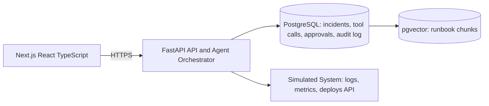

# Sentra

**AI incident copilot.**

Connect your system's logs, metrics, and runbooks. When something breaks,
Sentra investigates via autonomous read-only tool calls, produces an
evidence-cited root-cause hypothesis, and proposes next actions — but no
side-effecting action ever executes without explicit human approval.

> Status: early build — see [Roadmap](#roadmap) for what's done vs. planned.

## Architecture



The core design constraint: the distinction between read-only tools (agent
calls autonomously) and side-effecting tools (agent may only *propose*,
human must approve) is enforced at the orchestration layer in code — not by
prompting the model to behave. See `docs/spec.md` for the full design.

## Tech stack

- **Frontend:** Next.js, React, TypeScript, Tailwind CSS
- **Backend:** FastAPI, Pydantic, SQLAlchemy
- **Database:** PostgreSQL + pgvector
- **LLM:** hosted provider with native tool-calling, behind an abstraction layer

## Local development

### Prerequisites
- Docker (for Postgres + pgvector)
- Python 3.12+
- Node 20+

### 1. Database
```bash
docker compose up -d
```

### 2. Backend
```bash
cd backend
python -m venv .venv && source .venv/bin/activate
pip install -r requirements-dev.txt
cp ../.env.example ../.env   # fill in secrets
alembic upgrade head          # creates the schema
uvicorn app.main:app --reload
```
Backend runs at `http://localhost:8000`. Check `GET /health`.

### 3. Frontend
```bash
cd frontend
npm install
cp ../.env.example .env.local   # keep only NEXT_PUBLIC_API_URL
npm run dev
```
Frontend runs at `http://localhost:3000`.

### 4. Pre-commit hooks
```bash
pip install pre-commit
pre-commit install
```

## Roadmap

- [x] Phase 0 — Scope & repository setup
- [x] Phase 1 — Database + auth
- [ ] Phase 2 — Simulated system
- [ ] Phase 3 — Ingestion pipeline
- [ ] Phase 4 — Tool layer
- [ ] Phase 5 — Agent orchestrator
- [ ] Phase 6 — Approval workflow
- [ ] Phase 7 — Audit log
- [ ] Phase 8 — Investigation UI
- [ ] Phase 9 — Streaming + polish
- [ ] Phase 10 — Security + reliability
- [ ] Phase 11 — Evaluation
- [ ] Phase 12 — Deployment
- [ ] Phase 13 — Portfolio packaging

## License

MIT